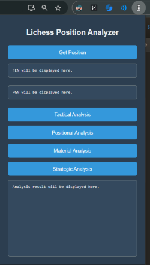
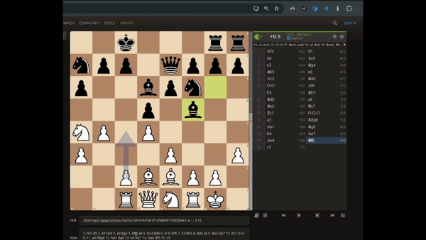
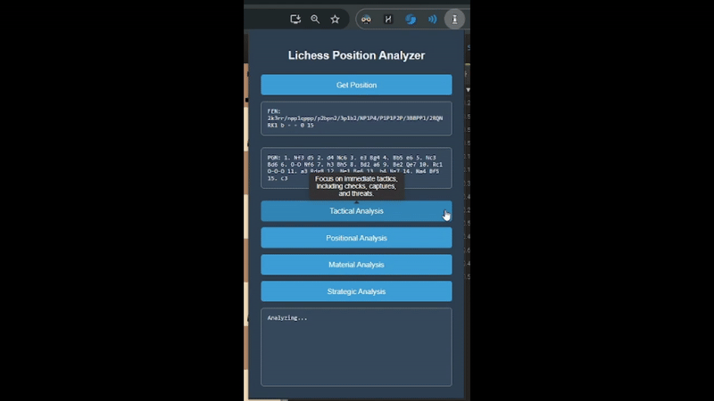

# Lichess Position Analyzer



## Overview

**Lichess Position Analyzer** is a Chrome extension that enhances your chess experience on Lichess by allowing you to extract and analyze positions directly from the analysis board. The extension provides tactical, positional, material, and strategic analyses using a server-side engine, LLMs, and Stockfish online.

## Features

- **Extract FEN & PGN:** Capture and display the current FEN and PGN strings from the Lichess analysis board.
- **Comprehensive Analysis:** Perform tactical, positional, material, and strategic analyses using Stockfish online and LLMs based on the extracted positions.
- **Interactive Interface:** User-friendly interface with tooltips explaining each analysis type.

## Technologies Used

- **Frontend:** JavaScript, HTML, CSS, Chrome Extension APIs
- **Backend:** Python, Flask, OpenAI API, Stockfish online (hosted on Render)

## Screenshots and Descriptions

### Popup Interface


*Displays the extension's interface where users can extract FEN and PGN, and perform various types of analysis.*

### Extracting FEN & PGN


*After clicking "Get Position," the FEN and PGN strings are displayed, allowing for further analysis.*

### Performing Tactical Analysis


*The extension provides a detailed tactical analysis based on the current chess position using Stockfish online.*

## Setup and Installation

### Prerequisites

- Python 3.x
- Flask
- OpenAI Python package

### Installation

1. **Clone the repository**:

    ```sh
    git clone https://github.com/yourusername/lichess_position_analyzer.git
    cd lichess_position_analyzer
    ```

2. **Navigate to the backend directory and install the dependencies**:

    ```sh
    cd backend
    pip install -r requirements.txt
    ```

3. **Add your OpenAI API key**:

    Replace the placeholder in the `.env` file with your actual OpenAI API key.

    ```env
    OPENAI_API_KEY=your-openai-api-key
    ```

4. **Run the server**:

    ```sh
    python server.py
    ```

### Usage

1. **Load the Chrome Extension:**

    - Open Chrome and navigate to `chrome://extensions/`
    - Enable `Developer mode`
    - Click on `Load unpacked` and select the `lichess_position_analyzer/extension` directory

2. **Using the Extension:**

    - Open Lichess and navigate to the analysis board
    - Click on the extension icon in the Chrome toolbar
    - Extract the FEN and PGN by clicking "Get Position"
    - Choose an analysis type (Tactical, Positional, Material, or Strategic) to get the analysis results

## Project Structure

```bash
lichess_position_analyzer/
├── backend/
│   ├── .env                   # Environment variables
│   ├── Procfile               # Gunicorn configuration
│   ├── requirements.txt       # Backend dependencies
│   ├── server.py              # Main backend file
│
└── extension/
    ├── icons/
    │   ├── icon16.png         # Extension icon (16x16)
    │   ├── icon48.png         # Extension icon (48x48)
    │   └── icon128.png        # Extension icon (128x128)
    ├── background.js          # Service worker script for background tasks
    ├── content.js             # Content script to interact with Lichess page
    ├── manifest.json          # Extension configuration
    ├── popup.html             # Popup interface
    ├── popup.js               # Script for popup interactions
    ├── style.css              # Styling for the extension
    └── images/
        ├── get-fen.gif        # GIF showing the extraction of FEN and PGN
        ├── analysis.gif       # GIF showing tactical analysis
        └── image.png          # General image for the README
